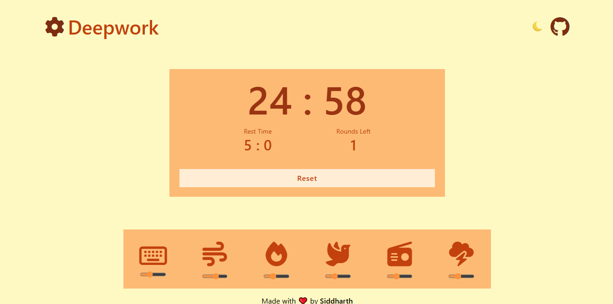
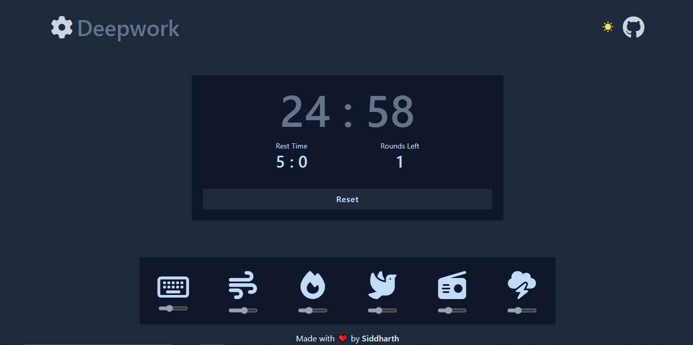

# [deepwork](https://deepwork-app.vercel.app/)

### Deployment: [deepwork-app.vercel.app](https://deepwork-app.vercel.app/)
---

## What is deepwork?
It's a productivity app that I made to make my life easier. You can use it to for your needs. Do you follow **pomodoro** technique? Then you'll love **deepwork**. I have added a timer with a bunch of useful features. And that's not it, if you like listening to ambient sound while working then **deepwork** got you covered. Deepwork has six different ambient sounds with separate volume control for each sound.

**The feature that I love the most is its audio notifications🔊 deepwork will notify you to take breaks, hydrate yourself, and also stretch your body. This can be very helpful when you are working for long hours.**

## deepwork UI

### Light Mode:

### Dark Mode:

## Features
- **deepwork Session:** Get in flow➡️Recharge➡️Repeat🔁
  - Flow Time: 25mins, 40mins, 60mins
  -  Recharge Time: 5mins, 10mins, 15mins
  - And this is **the most unique feature** of [deepwork](https://deepwork-app.vercel.app/) the ability to repeat your session.
  - You can **select number of times you want to repeat the timer**.
  ---
- **Audio & Desktop Notifications:** Get audio and desktop notifications
  - You'll be notified when it's time to recharge your body.
  - You'll get **notification to hydrate and stretch your body**(useful, isn't it)
  - Limited notification: I know you want to get work done, we'll not bother you with too many notifications. You'll only hear from us in your free time✌️
  ---
- **Ambient White Noise:** We have 6 different ambient sounds that you can use to get into flow.
  - Mechanical Keyboard
  - Winds
  - Fire
  - Forest
  - Radio Static
  - Public Place
  ---
- **Mute All:** Mute all the ambient sounds in one key press. No need to mute every single sound manually, just press *m* and no more sounds.

## Technology Used & Attribution
- JavaScript
  - Event Listeners & DOM Manipulation
  - Asynchronous JavaScript
- [Vercel](https://vercel.com/): Deployment & Analytics
- [Wideo](https://wideo.co/text-to-speech/): For audio notifications
- [flaticon](https://www.flaticon.com/): Theme Icons
- [Pixabay](http://pixabay.com/music): Ambient Sounds
- [Favicon](favicon.io): Favicon Generator